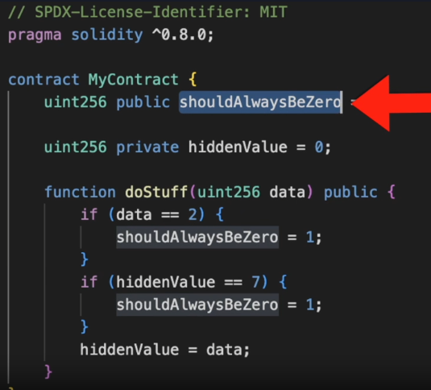
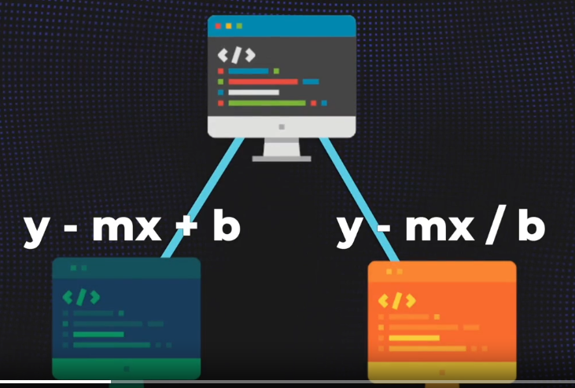
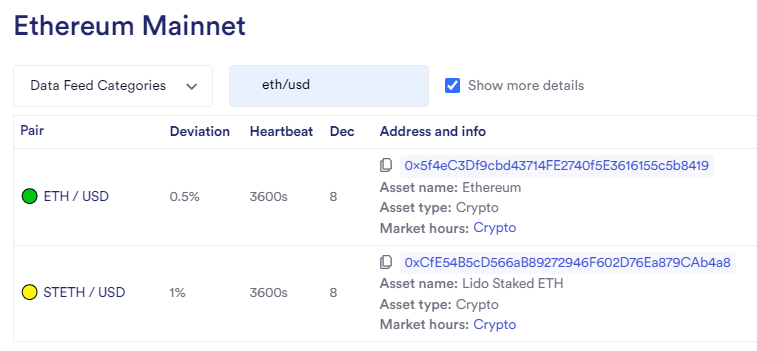

# Foundry DeFi | Stablecoin Lesson Notes

### Lesson Overview

This lesson explores what DeFi is, applications and a bunch of other things. During this lesson we will cover:

- Creation of an ERC20 token that will represent the value of the US dollar - stablecoin
- 1 token will represent 1 US dollar
- Tokens are pegged and backed by US dollars
- System will always be "overcollateralised". At no point, should the value of all collateral < the \$ backed value of all the tokens

The project will include source smart contracts for the DeFi system, deployment scripts for different chains, test suites for our smart contracts and scripts.

**_Note: The design of our DeFi system will be minimal in nature in comparison to large, real-world applications. This is an instructional lesson on the topic_**

## DeFi Overview

[DeFi Llama](https://defillama.com/) - website that gives insight into the world of DeFi.
[Maker DAO Forums](https://forum.makerdao.com/g) - Forums of the Maker DAO which is what this lesson's project is loosely based around

DeFi is such a broad area that it is difficult to provide all information you need to know. I can, however, provide some quick general statements about DeFi:

- DeFi is decentralised - with no reliance of 'trusting' intermediaries in traditional finance
- DeFi is programmatic. It allows scalability, automation and also removes those intermediaries
- DeFi is globally accessible to anyon with an internet connection. Breaking geograpchicaal barriers and underserved regions.
- DeFi on blockchain provides transaprency and immutability. Transactions and volumes can be verified in real-time.
- There is a large sense of familiarity of concepts between DeFi and traditional, centralised finance
- Exchanges, borrowing and lending, staking/locking of funds for periods of time all exist in DeFi
- Yield protocols of DeFi work similiar to passive income generation that is seen with bonds, interest savings account, stock dividends
- DeFi also includes protocls called Collateralized Debt Position (CDP). A CDP protocol allows users to lock up a certain amount of cryptocurrency as collateral to generate a loan in another cryptocurrency. An example is the MakerDAO system, users can lock up Ether (ETH) as collateral to generate DAI, a stablecoin pegged to the value of the US dollar. The locked-up ETH serves as collateral for the DAI loan, and users can later retrieve their collateral by repaying the borrowed DAI plus any accrued interest. There is no direct equivelance, but similarities can be found in: secured loans, margin trading, home equity lines of credit
- It also includes ver standard transacting use cases - like buying and selling things, not just digitalised things but also paying for real work objects/services

### Quick Section on Maximal Extractable Value (MEV)

[Flashbots](https://docs.flashbots.net/) - Wesbite aimed to reduce, prevent and remediate actions by bad actors looking to manipulate the blockchain for themselves.

Maximal Extractable Value (MEV) and MEV bots, is a topic we won't cover in this lesson but it becomes more and more important as we work through this lesson and continue to progress.

Blockchain validator nodes, when preparing block submissions, are able to order the transactions in such as way that a malicious actor can organise them in a manner that greatly benefits them - including stealing of funds.

## Introduction to Stablecoins

A stablecoin in the context of Web3 and decentralized finance (DeFi) refers to a type of cryptocurrency that is designed to maintain a stable value relative to a fiat currency or another asset. Stablecoins aim to mitigate the price volatility commonly associated with many cryptocurrencies like Bitcoin or Ethereum, making them more suitable for everyday transactions, smart contract executions, and as a store of value.

There are several mechanisms through which stablecoins achieve price stability:

1. Fiat-collateralized stablecoins: These stablecoins are backed by reserves of fiat currency (e.g., US dollars) held in a bank account or other custodial arrangement. Each stablecoin issued is backed by a corresponding amount of fiat currency held in reserve. Examples of fiat-collateralized stablecoins include Tether (USDT), USD Coin (USDC), and TrueUSD (TUSD).

2. Crypto-collateralized stablecoins: These stablecoins are backed by reserves of other cryptocurrencies, typically held in a smart contract. Users lock up cryptocurrencies like Ether (ETH) or Bitcoin (BTC) as collateral to generate stablecoin tokens. The value of the collateralized cryptocurrencies must exceed the value of the stablecoin tokens issued to maintain price stability. MakerDAO's DAI is an example of a crypto-collateralized stablecoin.

3. Algorithmic stablecoins: These stablecoins use algorithmic mechanisms to maintain price stability without explicit collateral backing. Algorithms adjust the stablecoin's supply based on supply-demand dynamics, aiming to keep the price pegged to a target value, such as \$1. Examples include Terra's UST and Ampleforth (AMPL).

## Features of the stablecoin of this project

1. Relative Stability: Anchored or Pegged against \$1 USD
   1. Will use Chainlink pricefeed
   2. Set a function to exchange ETH and BTC for what their equivelant \$USD is
2. Stability Mechanism (Minting): Done Algorithmitically (Decentralised), 100% on-chain. No controlling entity.
   1. People can only mint the stablecoin when they have enough collateral (coded into smart contract)
3. Collateral Type: Exogenous (Crypto) - will use crypto as collateral. Accepting the following:
   1. ETH - the ERC20 version -> wETH (wrapped ETH)
   2. BTC - the ERC20 version -> wBTC (wrapped BTC)

## DecantralisedStableCoin.sol

The DecentralisedStableCoin.sol smart contract is this systems ERC20 token. It is minimalistic in contained functions because of the fact that we will have our 'engine' contract that will handle the bulk of our logic, and this token is simply utilised by the engine to achieve its requirements.

We utilise the Open Zeppelin contracts for the ERC20 structure, including its functions.

The only new programming syntax in this file is the use of the **'super'** keyword.

The super keyword allows us to tell our smart contract to refer to an inherrited file for that function/variable and not just this current contract.

## Planning Requirements for a Project - How using an Interface with the enginge contract can help

With projects, its important that we develop a list of requirements that need to be achieved. This will drive thinking about what functions are required for each requirement.

When it comes time for development, often developers will code an interface that can be inherrited by their core contract - in our case, the Decentralised Stable Coin Engine (DSCEngine.sol). The interface will contain a whole bunch of functions that the core contract needs, and acts as a tool to allow developers to be ware of what they need to code out in their core contract.

For this lesson's project, we are just going to have them written in the DSCEngine.sol file, in the DSCEngine contract.

## What is an overcollaterised system?

In an overcollateralized DeFi system, users can borrow funds by providing more collateral than the value of the loan they want to take. This excess collateral acts as a buffer to cover any potential fluctuations in the value of the assets being used as collateral. An overcollateralised system is where the value amount of collateral will **NEVER** be worth less than the valued amount of all the backed/pegged tokens.

For example, we deposit wETH as collateral that at the times was worth \$60 dollars. For this, we recieved \$40 worth of backed tokens. Then, the value of wETH plummits drastically to \$10 dollars. This will cause drasatic instability in the valuation of the backed tokens as they are now not worth the orignal backed amount. An overcollateralised system prevents this from happening by ensuring that there is always more value in collateral than in the value of redeemed tokens/currency. This system will have precautions in place to liquidate, remove peoples positions, if they are nearing the point of having their collateral value threaten breaking the stability.

In these systems, there are often thresholds that are used to determine if actions is required to be taken to prevent instability of the backed tokens/currencies.

### Liquidating

Liquidation occurs when the value of the collateral falls below a certain threshold, typically determined by the protocol's rules. When this happens, the system automatically sells a portion of the collateral to repay the borrowed funds and any accrued interest. This ensures that the loan remains fully collateralized and reduces the risk for the lender.

Here's a simple analogy:

Imagine you borrow \$100 from a friend, and you give them your watch as collateral, which is worth \$200. This is overcollateralization because the value of your collateral (\$200) is more than the value of the loan (\$100). Now, if the value of the watch drops to \$150, you might be in danger of defaulting on the loan because the collateral is no longer enough to cover the loan amount. In this case, your friend might decide to sell the watch to get their \$100 back.

Similarly, in a DeFi system, if the value of your collateral drops below a certain threshold, the protocol may automatically sell a portion of your collateral to repay the loan. This is called liquidation.

The using of thresholds can also incentivise other accounts/individuals to liquidate others in bad positions to maintain stability, by offering rewards. For example:

An individual deposits \$100 wETH as collateral and redeems \$50 of a stable token. The protocol has a 25% threshold. The value of wETH drops to \$74, this raises alerts for breaching the threshold of 25% and allows liquidation to occur. An individual covers the cost of the \$50 of the token, while the original depositor has their amount reduced to zero. As a reward for ensuring stability and covering the cost of the \$50 worth of the token, that individual is rewarded with the \$74 worth of collateral that was put down. The token remains stable, the original depositor is not in debt, and whom it was that liquidated the depositor is rewarded for assisting the stability.

Liquidation helps maintain the stability and security of the DeFi system by ensuring that loans are adequately backed by collateral, even in volatile market conditions. It protects lenders from potential losses due to defaulting borrowers.

## Quick Section about nested mapping

```
mapping(address user => mapping(address token => uint256 amount)) private s_collateralDeposited;
```

Here's what each part of the code means:

**_mapping_**: In Solidity, a mapping is a data structure similar to a hash table or dictionary in other programming languages. It maps keys to values and allows for efficient lookup and storage of data. In this case, the mapping is used to associate a user's address with another mapping.

_address user_: This is the key of the outer mapping. It represents the Ethereum address of a user who interacts with the smart contract. Each user's address will correspond to a separate inner mapping.

**_mapping(address token => uint256 amount)_**: This is the inner mapping. It associates ERC20 token addresses with the amount of that token deposited by the user. The key of this inner mapping is the address of the ERC20 token, and the value associated with each token address is the amount of that token deposited by the user.

_address token_: This represents the key of the inner mapping, which is the address of an ERC20 token.

_uint256 amount_: This represents the value associated with each token address in the inner mapping. It indicates the amount of the corresponding ERC20 token deposited by the user.

_private_: This keyword denotes that the mapping is only accessible within the current contract and cannot be accessed or modified from outside the contract.

So, in summary, this mapping is used to track the amount of each ERC20 token deposited by each user in a smart contract. It allows the contract to keep a record of the collateral deposited by users.

## Walkthrough of the Health Factor Rating & Associated Math Used in This Project

In this project, we use the ratio of collateral value a user has, against the number of minted DSC a user has to determine the health factor of the user.

To achieve this, we are required to decide what percentage minimum extra value a users collateral must be in order to keep the system in overcollateralisation. This percentage is normally quite a bit higher then the value of the collateral so that liquidation can occur before any negative consequences occur for our stablecoin and the system in general (we are pegging our token to the USD).

To ensure you understand what is happening in this process, we will walk through what is occuring in the project.

Firstly, this example assumes we have already got the total collateral value of a user in USD, and we also have the number of minted DSC a user has.

### Thresholds and Precision values

In this project, we use constant variables to store our projects threshold, and also the precision we want to employ for calculations.

```
 uint256 private constant PRECISION = 1e18;

//Liquidation threshold - used to determine when to liquidate a user so that we always remain overcollateralised. VIEW LIKE 50 OUT OF 100, OR 50%
uint256 private constant LIQUIDATION_THRESHOLD = 50; // means you need to be 200% overcollateralised

//Liquidiation precision - VIEW LIKE 100%, OR 100 OUR OF 100
uint256 private constant LIQUIDATION_PRECISION = 100;
```

As you can see in the comments, its easier to think of these values as a percentage out of 100.

**But what does the 50 in the LIQUIDATION_THRESHOLD variable actually mean?**

What this value means is that even if the value of the collateral drops by half, it still covers the DSC debt. Therefore, users need to maintain 200% collateralisation.

So if we imagine the whole collateral value is worth \$200 USD, our code allows the user to have \$100 USD worth of our USD pegged DSC tokens - meaning 100 DSC.
If the users collateral became volatile and decreasing in value, we allow the users total collateral value to drop by 50% before we liquidate - e.g. the users collateral is now worth \$100 USD - the same as our DSC token, which threatens the pegging of our DSC to the USD if the price continues to fall, and will violate our overcollateralised system.

**What is the LIQUIDATION_PRECISION?**

The LIQUIDATION_PRECISION value represents the granularity of the liquidation threshold. A higher precision means the threshold is more finely divided, while a lower precision results in a coarser threshold.

The LIQUIDATION_PRECISION constant is used to divide the liquidation threshold value. When the precision is higher, the liquidation threshold value is divided into more parts, making the threshold stricter. This means that users need to maintain a higher level of collateral relative to their debt to avoid liquidation.

Conversely, when the precision is lower, the liquidation threshold value is divided into fewer parts, making the threshold more lenient. Users may need to maintain a lower level of collateral relative to their debt to avoid liquidation.

**Using the Threshold and Precision in Equation**

```
uint256 collateralAdjustedForThreshold =
            (totalCollateralValueInUSD * LIQUIDATION_THRESHOLD) / LIQUIDATION_PRECISION;

        //Will be a very large number because of the exponent, but calling function can compare against 1e18 to determine if below minimum health score
        return (collateralAdjustedForThreshold * PRECISION) / totalDscMinted;
```

Calculating these equations, we can generate a value that is 1e18 long. Which we can make easier for human readers by dividing by 1e18. Lets walk through an example using the constant variables from before:

```
 collateralAdjustedForThreshold = (\$200 * 50) / 100 =  100

 Health Factor = (100 (from result above) * 1e18) => 100,000,000,000,000,000,000 (100e18) / 100 (total DSC minted by user) = 1,000,000,000,000,000,000 (1e18)

 Health Factor = 1,000,000,000,000,000,000 / 1e18 = 1
```

Our Project says that the MINIMUM health score we allow before liquidation is 1. Anything below the value of 1 will trigger liquidation. So the user in this first example is healthy.

Let's walk through another example:

```
collateralAdjustedForThreshold = (\$175 * 50) / 100 = 87.5

Health Factor = (87.5 (from result above) * 1e18) => 87,500,000,000,000,000,000 (87.5e18) / 100 (total DSC minted by user) = 875,000,000,000,000,000

Health Factor = 875,000,000,000,000,000 / 1e18 = 0.875
```

This user is found to only have a health factor of 0.875, meaning its violated our over collaterisation threshold measures and this user can and will be liquidated!

## Testing while Developing Tip

After laying down some foundational logic, we want to begin to incorporate testing into our project lifecycle so that we are able to identify and rectify any problems earlier in the project lifecycle. We don't want to spend months or years working on a very large codebase without conducting periodic testing, only to have to re-enter a significant development cycle when we finally conduct thorough testing and uncover a number of issues. Sometimes the issues will affect other areas of your code that will then also require fixing!

A simple approach to use is:
1. Build out the rough layout of your code, using any design documents to aid in this.
2. Compile code to help identify any issues straight away (e.g. syntax violations, access modifiers, etc)
3. Begin to tackle one function, or one design requirement at a time. Break large requirements into smaller sections and work through those.
4. When you have built out some logic in functions, or abstract contracts, libraries, etc. Begin to write some unit tests for those pieces of logic. You may also need to work on creating deploy contracts, to be able to deploy the project code youre working on for testing. Your testing scope will also broaden to include interactions outside of your smart contracts!
5. Run tests, record results, rectify issues, run tests, record results, rectify issues.... Repeat until the issues are resolved and the code operates as expected and meets design, security, and compliance requirements.
6. Repeat steps 3-5 until development is complete

This is a very brief and high-level guide. There are many resources available that dive deeper into this topic, but I wanted to ensure that I included some brief guidance.

## Invariant definition, Layers of testing, Symbolic Execution & Formal Verification

### Invariants

In programming, the term "invariant" refers to a condition that remains true (unchanged) throughout the execution of a program or a specific portion of code, especially during critical points such as before and after function calls, loops, or state changes. In other words, it's something that should always hold true at specific points in the code.

Ensuring that invariants are maintained is important for the correctness and stability of the program. Violating invariants can lead to unexpected behavior, bugs, or program crashes.

For example, consider a banking application where the total balance of all accounts should always be non-negative. This is an invariant because it must hold true regardless of any deposits, withdrawals, or transfers happening in the system.

Invariants are often enforced through validation checks, assertions, or by designing algorithms and data structures in a way that preserves these properties.

**Example in Soldiity**

Let's create a simple smart contract in Solidity that represents a bank account and ensures the invariant of a non-negative balance:

```
// SPDX-License-Identifier: MIT
pragma solidity ^0.8.19;

//INVARIANT: The users bank balance should never be zero, regardless of withdrawing or depositing

contract Bank {
    // Mapping to store balances of each account
    mapping(address => uint256) public balances;

    // Event to log deposit and withdrawal events
    event Deposit(address indexed account, uint256 amount);
    event Withdrawal(address indexed account, uint256 amount);

    // Function to deposit funds into the account
    function deposit(uint256 amount) public {
        require(amount > 0, "Deposit amount must be greater than 0");
        
        balances[msg.sender] += amount;
        emit Deposit(msg.sender, amount);
    }

    // Function to withdraw funds from the account
    function withdraw(uint256 amount) public {
        require(amount > 0, "Withdrawal amount must be greater than 0");
        require(balances[msg.sender] >= amount, "Insufficient balance");
        
        balances[msg.sender] -= amount;
        emit Withdrawal(msg.sender, amount);
    }

    // Function to get the balance of an account
    function getBalance() public view returns (uint256) {
        return balances[msg.sender];
    }
}
```

In this code:

- We have a Bank contract with a mapping balances to store the balances of each account.
- The deposit function allows users to deposit funds into their account. It increases their balance and emits a Deposit event.
- The withdraw function allows users to withdraw funds from their account. It decreases their balance and emits a Withdrawal event.
- Both deposit and withdraw functions include checks to ensure that the amount being deposited or withdrawn is greater than 0 and that the account has sufficient balance.
- The invariant here is that the balance of an account should always be non-negative, and this is enforced by the code in the withdraw function.
- By maintaining this invariant, we ensure the integrity and correctness of our banking system on the blockchain

### Layers of Testing Talk

There are a number of different levels of testing that a good developer would do on their code. A lot of this includes verifying our invariants remain as expected.


#### Layer 1 - Unit Testing

Testing very specific pieces of code, like functions and statements. Testing each function and statement thoroughly, while looking at the breadth of tests - or test coverage for statements, functions, branches, etc.

THIS IS THE BARE MINIMUM, WELL.... IT WAS, UNTIL FUZZ TESTS CAME ALONG

#### Layer 2 - Fuzz Tests

Fuzzing is where you take random inp8uts and run them through your code. You have to define things in your code that you always want to hold true. We define a property in our program and then we throw a bunch of random values to try and break it!

If you find something that breaks it, you know you have an adge case that you need to refactor your code to handle.

Some example:

- We have a balloon, that we market as being un-poppable - can't be broken (invariant), and we try and throw and use a crazy number of random items to pop this balloon and we do this over and over.

- Having a function that completes a bunch of math and you know the function should never return zero (invariant), so you throw a whole bunch of numbers to the function to try and get it to return zero.

##### Role of Fuzz Testing on Invariants

Fuzz tests allow us to write a single test that focuses on a particular aspect or invariant, and using the one test repeat the test many time sover using random data to try and see if the invariant or expected logic breaks that is being tested.

An easy way to understand the ability it gives us and the time that we can save using these tests, imagine if needed to verify an input X == Y in a function, with Y being a very very large or unknown-to-us value. In traditional test writing we would be writing test after test so that we could pass X+1 over and over - this would be extremely inefficient!

##### Fuzz Tests in Foundry

Foundry makes it super easy to write tests for our code, and it also makes it just as easy to write Fuzz tests!

To turn a normal test, which is the majority of tests that we have used throughout this whole course, into a fuzz test all we need to do is provide paramater inputs into the test and then for any function or logic calls within that test we can reference that parameter input. Then Foundry when we run the test will AUTOMATICALLY generate random data for that test param input to be used in the test and it will repeat this over and over again for us!

```
// In This example imagine we are testing a function that should always allow users to mint a token, doesn't matter how many (invaraint) and -
// we are wanting to test this logic and invariant.

// Standard looking test in Foundry

function testCanAlwaysMintTokens() public {
   //Hardcoding the value to input to the function
   uint256 amountOfTokens = 1;
   bool mintedTokens = myProject.mintedSpecialToken(amountOfTokens);
   assertFalse(maxAmountReached);
}

// Turning test into a Fuzz test

//Let Foundry know that it needs to pass random data in for this test and repeat the test over and over

function testCanAlwaysMintTokens(uint256 amountOfTokens) public {
   bool mintedTokens = myProject.mintedSpecialToken(amountOfTokens);
   assertTrue(mintedTokens);
}

// Perhaps in the fuzz test we were able to find a value for the input to the function that didn't allow us to mint as many tokens as we wanted to for - 
// - whatever reason, perhaps its the max total supply number that can be maintained correctyl and vioalting it causes issues? Who knows without diving - 
// - into it further, but fuzzing has helped us a lot!
```
##### Stateless Fuzz Tests - What the?

Stateless Fuzz Tests refers to the approach of fuzz testing where there is no record kept for previous effects on the state as the next fuzz test goes underway. This can introduce some points of consideration to be aware of, for example, perhaps there is logic where the param input changes the value of a variable and ONLY if that varaible remains in that state can another condition or branch occur.

Look at this image below, the only way that the second 'if' branch can ever be hit is if the function first encounters a param input of "7" where that value is stored, and then the function is called again. In stateless fuzzing, we could never reach this point without coming up with an approach to tackle this.



##### Stateful Fuzzing

Stateful fuzzing is where the final state of your previous fuzzing run is the starting state of your next run - This can include end results of functions and branches.

To create stateful fuzzing tests in foundry, we need to use the "invariant_" keyword and it requires a littel bit of set-up - including importing 'StdInvaraint' from Forge's StdInvariant.sol file. Foundry uses this invaraint word a lot when doing stateful fuzzing - They use the word invariant to mean stateful fuzzing, it doesn;t just throw random data but it will also call random functions!

```
// Short, quick demo of stateful fuzzing

// SPDX-License-Identifier: MIT

pragma solidity ^0.8.19;

import {Test} from "forge-std/Test.sol";
import {StdInvariant} from "forge-std/StdInvariant.sol";

//Contrac to test - keeping in single file for ease of demo
contract ExampleContract1 {

    uint256 public val1;
    uint256 public val2;
    uint256 public val3;

    function addToA(uint256 amount) external {
        val1 += amount;
        val3 += amount;
    }

    function addToB(uint256 amount) external {
        val2 += amount;
        val3 += amount;
    }

}

contract StatefulTestDemo is StdInvariant, Test {

   //Bunch of other code, like set up stuff

   // Contract whose functions and variables to randomly test and record state of
   ExampleContract1 foo;

    function setUp() external {
        foo = new ExampleContract1();
    }

    function invariant_A() external {
        assertEq(foo.val1() + foo.val2(), foo.val3());
    }

    function invariant_B() external {
        assertGe(foo.val1() + foo.val2(), foo.val3());
    }
   

}
```


#### Layer 3 - Static Analysis

Layer 1 and Layer 2 testing are both dynamic testing approaches. With dynamic meaning that you are actually something - running/executing our code.

Static analysis is where we don't run the code and instead look at the code itself, or use a tool like [Slither](https://github.com/crytic/slither) to look at our code, to identify issues. Even the solidity compiler can be viewed as a static analysis tool in a sense!

#### Layer 4 - Formal Verification

"Formal verification is the act of proving or disproving a given property of a system using a mathematical model" - Cyfrin

We make a mathematical model of our system, and the property of the system.

***Formal Verification tries to break properties using mathematical proofs***

There are a number of techniques that you can use for formal verification, some of these are:
- Symbolic Execution
- Abstract Intepretation
- Model Checking

##### Symbolic Representation

"Symbolic execution is one technique used for formal verification. Using a mathematical model" - Cyfrin

Symbolic execution looks at different paths in a program and creates a mathematical representation (equation) for each path. Or to put it more plainly converting your code to a mathematical expression - a bunch of boolean expressions based on variables, etc. After converting our code into mathematical representations, we can pass the math functions to a solver which will tell us if our property (the invariant) is true or false.

[secure-contract.com - Manticore & Intro to Symbolic Execution](https://secure-contracts.com/program-analysis/manticore/symbolic-execution-introduction.html)





**Symbolic Representation Lectures from YouTube**

[Nickolai Zeldovich - Spring 2020 Lecture 10: Symbolic execution](https://youtu.be/-t85LW_nwck?si=RwiSWtiqcSDLQ6TC)

[MIT OpenCourseWare - 10. Symbolic Execution](https://youtu.be/yRVZPvHYHzw?si=oT-fevUjdcPnP1WF)

**What does 'paths' mean?**

Paths refers to the different routes or sequences of instructions that can be taken during the execution of the code. The simplest way to think of a path is 'If - Else' statements. Where Path 1 is result of True in the 'If' statement, while path 2 is the result of False in the 'If' statement.

However, it can also expand beyond this into areas that don't immediately jump to the forefront of the midn to think about. For example, look at this piece of code here:

```
// SPDX-License-Identifier: MIT
pragma solidity ^0.8.19;

Contract SymbolicPathsDemo {
   //INVARIANT: function must never revert
   function f(uint256 a) public returns (uint256) {

      a = a + 1; //PATH 1 - WE SIMPLY JUST RETURN A + 1 - return(a+1)
                 //Path 2 - we pass in the max value for uint256 as 'a' and try to + 1 cauisng an overflow and causing the function to revert

      return a;
   }
}

```

In the example just shown:

**Path 1:** assert(a not 2^256 -1); a:= a+1 return a;
**Path 2:** assert(a := 2^256); revert;

**:=** = assignment operator.

If we use a tool to helper generate the expressions we want to use and then pass it into a solver, we are going to see that for each path the solver is going to return a True value. This True value for each path indicates that both are possible - which violates the invariant we specified that it should never revert. We have just found a bug/issue in our code because it breaks the invariant/property.

##### Symbolic Representation Tools and Links

We are able to manually write out the expressions to formally verify paths of code, which we can then pass to solvers that accept the format we wrote our expressions in, but there are also a number of tools available for us to use to help us:

[secure-contract.com - Manticore & Intro to Symbolic Execution](https://secure-contracts.com/program-analysis/manticore/symbolic-execution-introduction.html)

[Microsoft Z3 solver - uses SMTLIB formatting](https://microsoft.github.io/z3guide/playground/Freeform%20Editing)


[Trail of Bits - Manticore - uses SMTLIB formatting - Has Z3 solver](https://github.com/trailofbits/manticore)

[HEVM - The hevm project is an implementation of the Ethereum virtual machine (EVM) made specifically for symbolic execution, unit testing and debugging of smart contracts](https://github.com/ethereum/hevm)

Manticore and HEVM both come with a built in Z3 and therefore you can skip the step of converting booleans and just give you the output of the SMIT solver.

**Limitations of Symbolic Representation**

1. Its possible that solvers wont be able to answer our questions
   - Sometimes the server might not be able to solve the proposed question too, especially if it is extremely complex - usually a timeout is specified to the solver to prevent issues where it will take an extremely long time to return the answer - like trying to invert a hash function
2. Path Explosion Problem
   - There is too many paths for a computer to explore in a reasonable amount of time and a solver would never be able to finish

##### Is Formal Verificationt the be-all-end-all?

"If you want to know if a bug can occur and if the property can be broken, you don’t necessarily need formal method for that and you can use a fuzzer, which is way easier to use and provide like kind of the same type of value. - Josselin" (From Trail of Bits who Patrick spoke with on this topic) - [Patrick Collins Medium Article](https://patrickalphac.medium.com/formal-verification-symbolic-execution-the-security-silver-bullet-38e0ac9072eb)

"Sometimes a sufficiently powerful fuzzer is all you need, and symbolic execution and formal verification is overkill.

Additionally, even formal verification doesn’t prove your code is bug-free. All it does is mathematically prove your code does that one specific thing correctly" - [Patrick Collins Medium Article](https://patrickalphac.medium.com/formal-verification-symbolic-execution-the-security-silver-bullet-38e0ac9072eb)

## Tips on Fuzz stateful testing/Fuzzing (A.K.A as invaraint testing in Foundry)

Foundry uses the 'invaraint_' keyword in function names of the fuzz tests to identify if they are invariant tests, you append the rest of the function test name after it

### Open Testing

Open testing is where the default configuration for target contracts is set to all contracts deployed inside the test function and our test will randomly call functions across the board

### Targeted Invariant Testing

Invariant testing with Foundry allows us to specifiy specific smart contracts to run tests against where the fuzzer will randomlly call the functions within that contract, we can still provide type input parameters to pass in to test these functions too. Foundry will keep record of the state of the testing leading up to its stage so we aren't flying blind with the testing. Our tests are trying to break the invariant we specifiy with our asserts.

Here is a quick example of how we tell Foundry to target a smart contract for testing:
```
function setUp() public {
          
        //TargetContract tells foundry what contract to randomlly call functions of and pass random values to - We are going to pass our engine contract
        targetContract(address(myObject));
    }


//Invariant - should always equal deposited amount
function invariant_myObjectAlwaysHasBalance() public {

    uint256 depositedAmount = myObject.getDepositedAmount();
    uint256 contractBalance = myObject.balance;

    assertEq(depostedAmount,contractBalance);
}

```

#### Handlers

Handlers are contracts that we use when we might need to create certain conditions for testing - for example, we might need to pass a bunch of checks before we can execute a statement in a function and if we don't create the params to allow the testing to reach that point then we will never be able to test it.

When wanting to use handlers, which can be super useful, the way we work with them is to tell Foundry that the handler contract is the target contract! This tell foundry to call the functions within the handler contract and we still keep our assert in our invariants test file. The test will callthe functions of the handler, pass in paramter values and all the while we are still making sure our invariant remains as detailed. This also means that we aren't just limited to the handler having functions for one contract we want to test, we are able to test multiple contracts and their functions and see how this all holds up with our invariants.

forge-std also contains so many useful functions and tools for us to achieve the creation of scenario set up for testing - a super useful function is the 'bound(uint256 x, uint256 min, uint256 max)' function that allows us to manipulate a range of values a variable can be - for example, perhaps we can't have the test use a zero value so we set the minimum value to = 1, and maybe we also want to specifiy the max it can be so we pass a max, such as 'type(uint96).max'

```
    function setUp() public {
            
            //TargetContract tells foundry what contract to randomlly call functions of and pass random values to - We are going to pass our engine contract
            targetContract(address(Helper));
        }

    //Invariant - should always equal deposited amount
    function invariant_myObjectAlwaysHasBalance() public {

        uint256 depositedAmount = myObject.getDepositedAmount();
        uint256 contractBalance = myObject.balance;

        assertEq(depostedAmount,contractBalance);
    }


-----------------------------------------------------------------------------

contract Helper is Test {

    MyObject myObject

    uint96 public constant MAX_DEPOSIT_SIZE = type(uint96).max;

    //Constructor function is possible to initialise things


    //Set Up function to set everythin up for tests


    //DEPOSIT FUNCTIONS THAT WE CAN CONTROL FLOW AND VALUES OF FROM FUZZING PRIOR TO CALLING ACTUAL CONTRACT DEPOSIT FUNCTIONS

    function depositStuff(address user, uint256 someValue) public {
        someValue = bound(someValue,1,MAX_DEPOSIT_SIZE);

        //Only want to pass addresses that aren't address(0)
        if(user == address(0)){
            return;
        }

        //Call teh function that we want to test with the restricted params to create the scenario we are trying to fuzz
        bool success = myObject.depositStuff(user, someValue);

    }
}
```

### Fail on Revert vs Continue On Revert

We are able to provide Foundry invariant settings in our foundry.toml file to modify and control the execution of our invariant tests. See the example below:

```
[invariant]
runs = 250              # The number of runs that must execute for each invariant test group
depth = 50              # The number of calls executed to attempt to break invariants in one run
fail_on_revert = true   # Fails the invariant fuzzing if a revert occurs
```

There are different reasons and scenarios where we might want to change the values. Some consideration points are as follows:

- runs - too small amount and we might not find edge cases that break our invariant, too large and we might be wasting our time
- depth - too many for limited depth of project code makes use waste time, too little and we miss the coverage we might need
- fail_on_revert - our logic and test set up might be expecting reverts and we would be stopping our tests very fast instead of trying to break the actual invariant, perhaps we want to quickly get some tests up and running and see what results we get and more cases we have the better, perhaps reverts lead to something else that we want to include in our tests, perhaps we want to immediately revert because we restricted conditions and we are diving in trying to find edge cases that break our invariant

Due to the fact that there can be times where you might want to fail on revert and other times that you want to continue, it is quite common to create sub-folders of the fuzzing folder in test folder location to differentiate between testing for fail on revert and continue on revert and inside each of these folders is where you can have your tests files relevant to each direction you want to take on the fail_on_revert setting.
```
->test
--->fuzzing
------>ContinueOnRevertInvariants
--------->ContinueOnReverts.t.sol
--------->ContinueOnRevertHandler.t.sol
------>StopOnRevertInvariants
--------->StopOnReverts.t.sol
--------->StopOnRevertHandler.t.sol
```

### Ghost Variables

Ghost variables are varaibles that we create and implement in our fuzzing, including in our handler that we can use to help us with our testing that aren't actually part of the normal code. They are helpful in bounding values, tracking the amount of times a function is called, etc.

For example, perhaps we are expecting to see a value present > zero which should be the result of a function - maybe that function isn't getting enough GOOD calls with param values to fully execute all lines of code of the function - e.g we call return early.

We could implement a ghost variable to track how many times that function was called during the testing and reached the end of the function so that we can do some debugging. We could also move the increment of our varaible within the function itself to figure out where we might be encountering the problem we are trying to udnerstand.

#### Troubleshooting an issue in the Handler in this project using ghost variable

In this project, I had a problem in the handler where the total supply value was always zero and never being updated, using a ghost varaible allowed us to pinpoint where abouts an issue lied in the function. I realised that it had something to do with the collateral value of the msg.sender and the depositCollateral function - however, my orignal thinking was off an the actual cause which I originally thought it may have had something to do with the random order that these functions are called in. I was slightly off though, the reason why the totalCollateralValue was zero for msg.sender was not due to the order of which the functions (deposit and redeem functions) are called, but rather that Foundry fuzzing doesn't just pass random param values it will also use different addresses for its calls! This means that the address of msg.sender who deposited collateral before, isnt going to be the same address that is calling the mint function in the handler!

After identifying the problem, we know that we just need a way to use msg.sender addresses that have successfully deposited. This means we can then also use those addresses for redeeming collateral, as well as calling the mint function.

**How can we track addresses that we know have completed deposits?**

There is always a few ways to skin a cat and this is also true in this instance. Depending on your function designs in the handler you could call the deposit before executing the rest of the mint logic, you can create an array of addresses that you can interact with (taking consideration that you could push repeat addresses to the array), etc.

## Using Foundry to print out the functions of a contract and its function signature - 'forge inspect'

forge inspect is a useful command that can allow us to explore a variety of different information about a smart contract. Look a the code block below to see what fields we can inspect:

```$
$ forge inspect --help
Get specialized information about a smart contract

Usage: forge.exe inspect [OPTIONS] <CONTRACT> <FIELD>

Arguments:
  <CONTRACT>
          The identifier of the contract to inspect in the form `(<path>:)?<contractname>`

  <FIELD>
          The contract artifact field to inspect

          [possible values: abi, bytecode, deployedBytecode, assembly, assemblyOptimized, methodIdentifiers, gasEstimates, storageLayout, devdoc, ir, irOptimized, metadata, userdoc, ewasm, errors, events]


//EXAMPLE FORMAT TO INSPECT CONTRACT FUNCTIONS
$forge inspect CONTRACTNAME methods OR methodIdentifiers

$forge inspect DSCEngine methods
{
  "burnDSC(uint256)": "4c1697b1",
  "calculateHealthFactor(uint256,uint256)": "01f72884",
  "depositCollateral(address,uint256)": "a5d5db0c",
  "depositCollateralAndMintDSC(address,uint256,uint256)": "2575a367",
  "getAccountCollateralValue(address)": "7d1a4450",
  "getAccountInfo(address)": "7b510fe8",
  "getAdditionalPriceFeedPrecision()": "d40e0152",
  "getApprovedCollateralTokens()": "ae064d3e",
  "getCollateralTokenBalanceOfUser(address,address)": "777f4a0a",
  "getCollateralTokenPriceFeedAddress(address)": "b0cbab0c",
  "getDSCAddress()": "eb567df4",
  "getHealthFactor(address)": "fe6bcd7c",
  "getLiquidationBonus()": "59aa9e72",
  "getLiquidationPrecision()": "6c8102c0",
  "getLiquidationThreshold()": "4ae9b8bc",
  "getMinHealthFactor()": "8c1ae6c8",
  "getPrecision()": "9670c0bc",
  "getTokenAmountFromUSD(address,uint256)": "638ca89c",
  "getUsdValueOfToken(address,uint256)": "895298ae",
  "liquidate(address,address,uint256)": "26c01303",
  "mintDSC(uint256)": "d0bb6c6e",
  "redeemCollateral(address,uint256)": "9acd81b3",
  "redeemCollateralForDSC(address,uint256,uint256)": "0ebf956d"
}
```

## Managing Oracle Connection in your Project - They are their own system too, check on them

It is easy to fall into the trap of just simply bringing in what you require for your Oracle connection and then just forgetting about it and assuming it will work, however, oracles are their own system and we need to account for anything that may happen from their network. Essentially being defensive minded in our coding.

For example, in our project we are using an Oracle connection for pricefeeds through Chainlink, what if something was to happen to the the network getting new updated prices? We would be faced with old prices, or stale prices, for the pricefeeds we incorporate. We should build into our project some logic to check for staleness of prices so that we are combating any potential issues that arise from bad data input from the Chainlink Oracle - allowing us to do such things as pausing transaction until we recieve an updated pricefeed value of an answer.

The Chainlink Docs also have the 'Show more detail' checkbox to provide us quick analysis of the varying datafeeds key properties beyond just the code, such as: deviation, heartbeat (how often the answer should be getting updated), decimals used in pricing.



In fact, in this project we leverage a library that we can use to handle such checks. May organisation also provide these sort of libraries in packages to allow developers to quickly leverage this work and not have to build from scratch when ther should be repetitiveness of logic. In this project, I coded along with Patrick for the experience.

## Preparing Project For a Security Audit

A security audit and review should be an instrumental and key activity completed prior to deploying your project into the real world. This is to protect the project, and the users.

But a security audit is not a 1-stop-shop, there are steps that you should be taking from the very beggining of your project to ensure you are coding in as a secure manner as possible.

There are a number of resources that you casn use for reference to help with security considerations, they can include such things as checklists, best practises, templates, and so much more.

Below will be some useful links to review: 

[nascentxyz/simple-security-toolkit](https://github.com/nascentxyz/simple-security-toolkit)

[shanzson/Smart-Contract-Auditor-Tools-and-Techniques](https://github.com/shanzson/Smart-Contract-Auditor-Tools-and-Techniques)

[transmissions11/solcurity](https://github.com/transmissions11/solcurity)